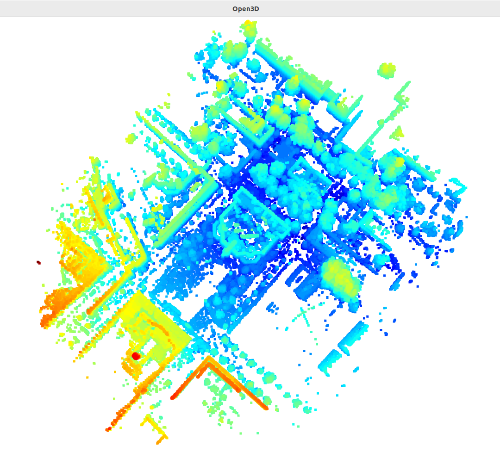
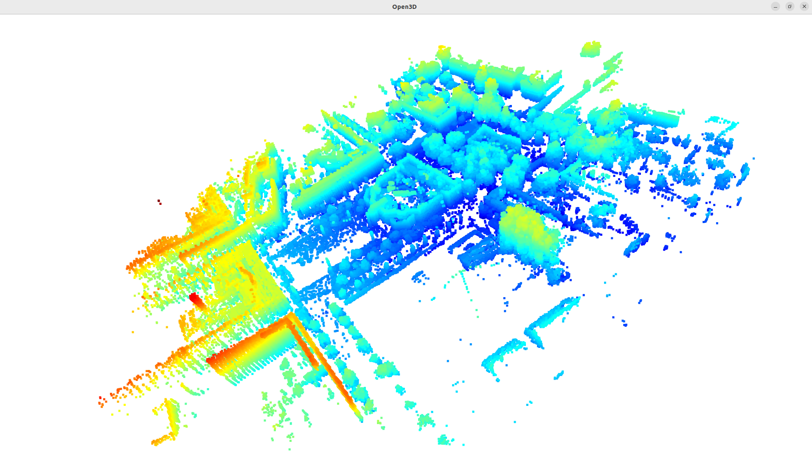
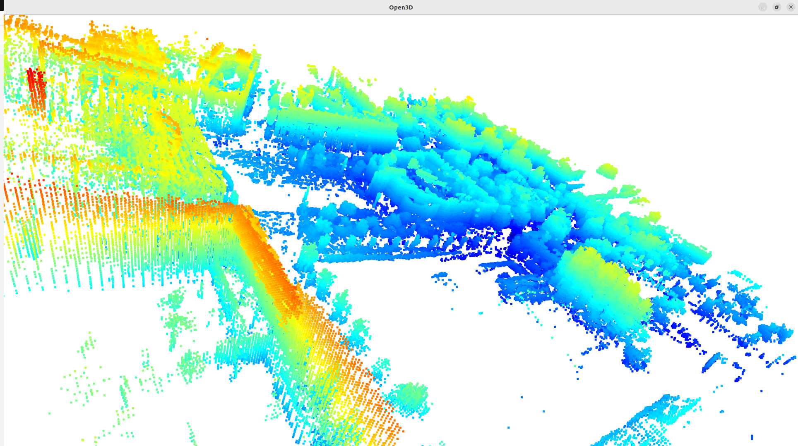

# 3D Occupancy Grid Mapping from LiDAR Scans

This is a C++ Uni Bonn course project for SoSe 25, which demonstrates the creation of a 3D occupancy grid map from a series of LiDAR scans and vehicle poses. It leverages modern C++17 features, the Eigen library for efficient linear algebra, and the Open3D library for visualization.

The application processes a dataset of point clouds, determines the optimal grid size and resolution, and then integrates each scan to build a map of the environment, distinguishing between free and occupied space.

## Project Overview

The core of the project is to build a probabilistic 3D map of an environment. This is achieved by:

1. **Analyzing the entire dataset** to calculate the necessary bounds for the world, ensuring the grid is large enough to contain the entire trajectory.
2. **Creating an optimal 3D grid** with a specified resolution. The implementation includes safeguards and auto-adjustments for memory-intensive configurations.
3. **Processing each LiDAR scan**: For each point in a scan, a ray is cast from the sensor origin to the point.
4. **Updating Voxel Occupancy**: Voxels along the ray are marked as "free," and the voxel at the ray's endpoint is marked as "occupied" using a log-odds probability model.
5. **Visualizing the Result**: The final set of occupied voxels is extracted and rendered as a 3D point cloud.

## Code Structure

The project is organized into several components to separate concerns:

-   `src/main.cpp`: The main entry point of the application. It orchestrates the entire workflow, from data loading and analysis to mapping and visualization.
-   `src/dataloader/`: A static library responsible for loading LiDAR point cloud data (`.ply` files) and the corresponding ground truth poses.
-   `src/data_analyser.cpp/.hpp`: Contains the logic to perform an initial pass over the entire dataset to determine the environment's boundaries, which is used to configure the optimal grid size and resolution.
-   `src/scan_processor.cpp/.hpp`: Handles the processing of individual LiDAR scans, transforming points to the world frame and integrating them into the occupancy grid.
-   `src/occupancy_grid.cpp/.hpp`: Implements the core 3D occupancy grid data structure, including voxel management, coordinate transformations, the log-odds update model, and the 3D Bresenham's algorithm for ray tracing.
-   `src/visualizer/`: An interface library that provides a simple wrapper around Open3D for visualizing the final grid of occupied voxels.

## Features

- **Dynamic Grid Sizing**: Automatically analyzes the dataset to determine optimal grid dimensions and origin.
- **Memory Management**: Includes warnings and automatic resolution adjustments for potentially large grid sizes.
- **Efficient Ray Tracing**: Implements a 3D Bresenham's line algorithm for ray casting.
- **Probabilistic Mapping**: Uses log-odds values to update voxel states, making the map robust to sensor noise.
- **Performance Optimized**: Written with modern C++ and performance in mind, leveraging stl algos, efficient stl containers, and release build optimizations.
- **3D Visualization**: Uses Open3D to render the final occupancy grid.

## Dependencies

- **Eigen3**: For matrix and vector operations.
- **Open3D**: For point cloud processing and visualization.

You can install the dependencies on a Debian-based system using:

```bash
sudo apt-get install libeigen3-dev libopen3d-dev
```

## Compilation

The project uses CMake. To compile, run the following commands from the project's root directory:

```bash
# Configure the project for a Release build
cmake -DCMAKE_BUILD_TYPE=Release -Bbuild -S.

# Build the project using 24 parallel jobs
cmake --build build -j 24
```

The executable will be located at `build/occupancy_grid_main`.

### Compiler Optimizations

For `Release` builds, the following compiler flags are enabled in `CMakeLists.txt` to maximize performance:
-   `-O3`: Enables the highest level of compiler optimization.
-   `-DNDEBUG`: Disables `assert()` calls to avoid runtime checks.
-   `-march=native`: Instructs the compiler to generate code specifically optimized for the CPU architecture of the machine it's being compiled on.
-   `-ffast-math`: Allows for more aggressive floating-point optimizations that may not be strictly IEEE-compliant but are faster.
-   `-funroll-loops`: Unrolls loops to reduce branch overhead, which can improve performance for tight loops.

## Execution

To run the application, provide the path to the data directory from the `build` directory:

```bash
./occupancy_grid_main ../src/Data
```

## Results

The following images show the final 3D occupancy grid generated from the full dataset, viewed from different angles.

**Top-Down View:**


**Side View:**


**Inside View:**


### Performance Statistics

The following statistics were recorded after processing the entire dataset of 6770 scans. The grid was configured with the following parameters:

- **Dataset Range (X, Y, Z)**: 276.9m, 343.8m, 47.8m
- **Grid Coverage**: From [-138.2, -223.1, -7.6] to [144.3, 127.9, 41.4]
- **Grid Origin**: -138.2, -223.1, -7.6
- **Grid Resolution**: 0.5m (50cm per voxel)
- **Grid Dimensions**: 565 x 702 x 98
- **Total Voxels**: 38,869,740

Performance results with the hash collision optimization enabled:

- **Total Scans Processed**: 6770
- **Total Execution Time**: 277.43 seconds
- **Average Time per Scan**: 40.83 ms
- **Scan Rate**: 24.4 scans/second
- **Final Occupied Voxels**: 245,669
- **Voxel Extraction Time**: 0.02 seconds

## Project Assignment

The detailed requirements and goals for this project are outlined in the official course assignment document.

[View Project Assignment](./project_assignment.pdf)

### Requirements Compliance

#### Mandatory Requirements

| Requirement | Implementation Details |
|-------------|----------------|
| **Modern CMake** | CMakeLists.txt uses modern practices with target_* commands |
| **Custom Class** | OccupancyGrid, DataAnalyzer, ScanProcessor classes |
| **STL Algorithm** | std::for_each, std::reduce, std::minmax_element, std::clamp |
| **STL Container** | std::vector, std::unordered_set, std::array |
| **Lambda Functions** | Multiple lambdas in Bresenham algorithm (drawLineH, drawLineV, drawLineD) |

#### Core Functionality

| Feature | Implementation Details |
|---------|----------------|
| **3D Bresenham Algorithm** | draw_bresenham3d_line() with complete 3D implementation |
| **Occupancy Grid Mapping** | Log-odds updates via update_occupied() and update_free() |
| **Data Loading API** | Uses dataloader::Dataset as specified |
| **Open3D Visualization** | visualize() function called with occupied voxels |
| **Comprehensive Timing** | Average scan time, total time, detailed statistics |

## References

This project was developed with the help of the following educational resources:

-   **Bresenham's Line Algorithm Visualization**: A clear visual explanation of the 2D Bresenham's algorithm, which forms the basis for the 3D implementation in this project. [Watch on YouTube](https://youtu.be/8gIhNSAXYcQ).
-   **Bresenham's Line Algorithm Coding Tutorial**: A coding tutorial for a 2D implementation of Bresenham's algorithm that was adapted to 3D for this project. [Watch on YouTube](https://youtu.be/CceepU1vIKo).
-   **SLAM Lecture on Occupancy Grid Mapping**: A comprehensive lecture covering the theory behind occupancy grid maps, including the log-odds representation, inverse sensor models, and the static binary Bayes filter, all of which are fundamental concepts for this project. [Watch on YouTube](https://youtu.be/v-Rm9TUG9LA).

## Output Logs

### Final Execution Output

```bash
saiga@sai-Ideapad:~/Downloads/ModernCppProject2025/build$ ./occupancy_grid_main ../src/Data
Loading dataset...
Found 6770 scans

=== ANALYZING WORKSPACE ===
Analyzing 6770 poses...
Processed 0/6770 scans...
Processed 338/6770 scans...
Processed 676/6770 scans...
Processed 1014/6770 scans...
Processed 1352/6770 scans...
Processed 1690/6770 scans...
Processed 2028/6770 scans...
Processed 2366/6770 scans...
Processed 2704/6770 scans...
Processed 3042/6770 scans...
Processed 3380/6770 scans...
Processed 3718/6770 scans...
Processed 4056/6770 scans...
Processed 4394/6770 scans...
Processed 4732/6770 scans...
Processed 5070/6770 scans...
Processed 5408/6770 scans...
Processed 5746/6770 scans...
Processed 6084/6770 scans...
Processed 6422/6770 scans...
Processed 6760/6770 scans...
=== WORKSPACE ANALYSIS ===
Robot trajectory bounds:
  Min: -135.352 -219.638 -7.10028
  Max: 141.576  124.18 40.7033
  Range: 276.928 343.819 47.8035
Total poses: 6770
Total points processed: 432690151
Dataset Analysis time: 26.0093 seconds 

=== OPTIMAL GRID CONFIGURATION ===
Origin: -163.1 -254.1  -11.9
Dimensions: 3324×4126×574
Resolution: 0.1m (10cm voxels)
Total voxels: 7872308976
Estimated memory: 30030.5 MB
Grid covers: [-163.1 -254.1  -11.9] to [169.3 158.5  45.5]
WARNING: Large memory usage! Consider:
  - Increasing resolution (e.g., 0.2m instead of 0.1m)
  - Reducing safety margin
  - Processing subset of data first

=== APPLYING OPTIMIZATIONS ===
Auto-adjusted resolution to: 0.5m
Optimized memory usage: 148.276 MB

=== OPTIMIZED GRID CONFIGURATION ===
Origin: -138.2 -223.1   -7.6
Dimensions: 565×702×98
Resolution: 0.5m (50cm per voxels)
Total voxels: 38869740
Estimated memory: 148.276 MB
Grid covers: [-138.2 -223.1   -7.6] to [144.3 127.9  41.4]

=== STARTING MAPPING ===
OccupancyGrid3D initialized:
  Dimensions: 565×702×98
  Resolution: 0.5m
  Origin: -138.2 -223.1   -7.6
  Total voxels: 38869740
Grid creation time: 0.048459 seconds 

=== PROCESSING LIDAR SCANS ===
Mapped :: 0/6770 scans...
Mapped :: 677/6770 scans...
Mapped :: 1354/6770 scans...
Mapped :: 2031/6770 scans...
Mapped :: 2708/6770 scans...
Mapped :: 3385/6770 scans...
Mapped :: 4062/6770 scans...
Mapped :: 4739/6770 scans...
Mapped :: 5416/6770 scans...
Mapped :: 6093/6770 scans...
Mapping completed!
=== SCAN STATISTICS ===
Total scans processed: 6770
Total execution time: 274.296 seconds
Best scan time: 0.0155139 seconds Worst scan time: 0.0891447 seconds 
Average time per scan: 40.3671 ms
Scan rate: 24.6814 scans/second
=== EXTRACTING OCCUPIED VOXELS ===
Extracted 245669 occupied voxels from 245669 tracked voxels (vs 38869740 total voxels)
Voxel extraction time: 0.018703 seconds.
Visualising Voxels using open3D ===
Visualizing 245669 occupied voxels...
Visualization time: 49.313 seconds.
```

